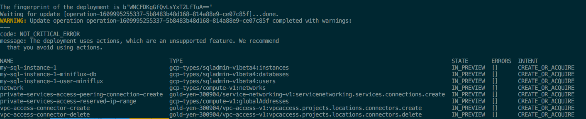
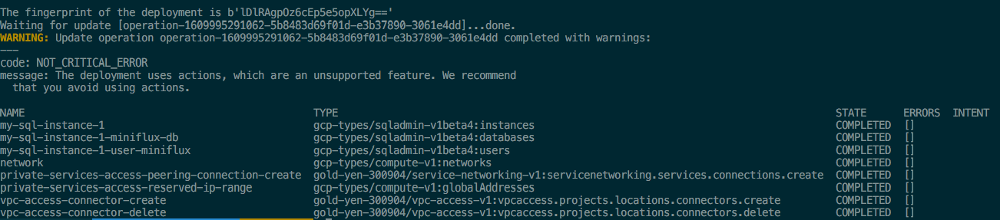
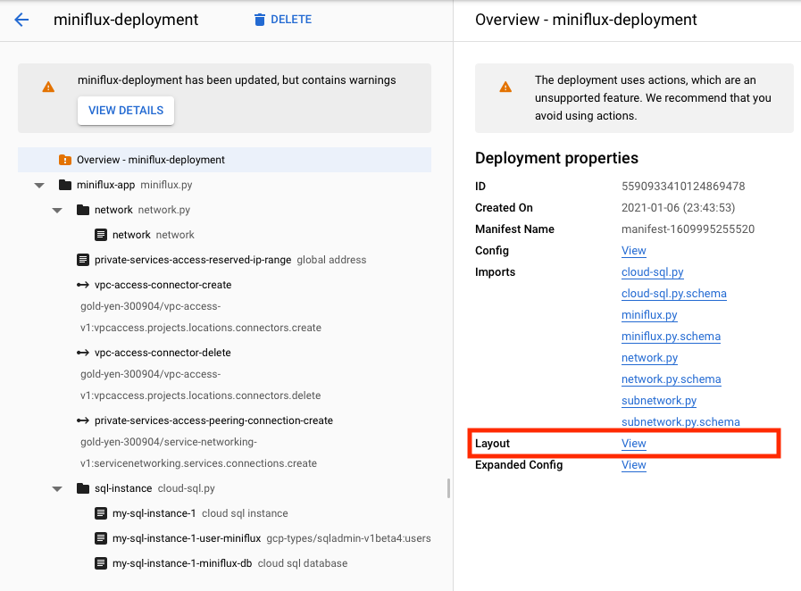
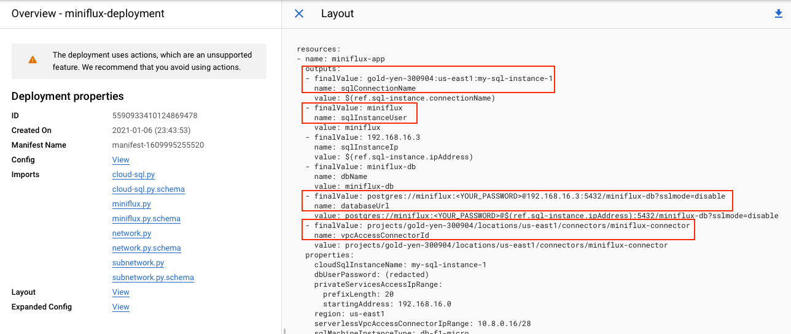

This repo contains detailed instructions to set up the free and open source feed reader [Miniflux](https://miniflux.app/) using [Terraform](https://www.terraform.io/) and [Google Cloud Deployment Manager (DM)](https://cloud.google.com/deployment-manager/docs/) on Google Cloud Platform (GCP).
The end result of these two workflows will be the same.
This is a case study to compare these two Infrastructure-as-Code tools.

## Prerequisites

- Install [Terraform](https://learn.hashicorp.com/tutorials/terraform/install-cli).
  These instructions were tested with version 0.14.3.
- Install [Google Cloud SDK (`gcloud`)](https://cloud.google.com/sdk/docs/install).
  Ensure that you are authenticated with your GCP credentials.
  If not, run `gcloud auth login`.
  These instructions were tested with version 321.0.0

## Terraform

- Create a GCP project and a service account (henceforth called the Terraform service account) that will be used by Terraform to provision GCP resources.
  Set this project ID as the value of the `project_id` argument in [`main.tf`](main.tf).
- Follow the [instructions here](https://github.com/huy-nguyen/terraform-google-miniflux/tree/v5.0.2#prerequisites) to enable the appropriate APIs for the project and IAM roles for the Terraform service account.
  Following the principle of least privilege, I've tried to keep the number of APIs and IAM roles as small as possible
- [Create a JSON key file](https://cloud.google.com/iam/docs/creating-managing-service-account-keys#iam-service-account-keys-create-console) containing the credentials of the service account, download it into the project directory and set the value of the `GOOGLE_APPLICATION_CREDENTIALS` environment variable to the relative path to this JSON key file.
- Run `terraform init` to download all required Terraform modules.
  This command only needs to be run once.
- Edit [`main.tf`](main.tf), the top-level configuration, to your liking (based on the available input variables listed in [variables.tf](https://github.com/huy-nguyen/terraform-google-miniflux/blob/v5.0.2/variables.tf)), then run `terraform apply` to create the resources.
- Run `terraform output` to get the output values that will be necessary in the next step.
- Follow the [instructions here](https://github.com/huy-nguyen/terraform-google-miniflux/tree/v5.0.2#deployment-to-app-engine) to deploy Miniflux to App Engine using the outputs from the previous step.
- Once you are done, tear down the infrastructure by running `terraform destroy`.

## Google Cloud Deployment Manager

- Create a GCP project and set it to be `gcloud`'s default project by running `gcloud config set-value project [PROJECT-ID]`.
- Enable the [same set of APIs](https://github.com/huy-nguyen/terraform-google-miniflux/tree/v4.0.0#deployment-to-app-engine) that was needed by the Terraform setup.
  Additionally, you also need to enable the Cloud Deployment Manager API (`deploymentmanager.googleapis.com`) for DM to work.
- Give the Google API Service Agent the Service Networking Admin IAM role (`roles/servicenetworking.networksAdmin`).
  This is a special service account of the form `[PROJECT_NUMBER]@cloudservices.gserviceaccount.com` that "is designed specifically to run internal Google processes on your behalf."
  In particular, DM [uses this service account](https://cloud.google.com/deployment-manager/docs/access-control#access_control_for) to create, delete and manage GCP resources.
  Think of this as the Terraform service account you created earlier.
  However, unlike that Terraform service account, the Google API Service Agent is already given Editor role on the project by default.
  As such, you don't need to give it as many additional IAM roles.
- Because there is no Google-managed [type provider](https://cloud.google.com/deployment-manager/docs/fundamentals#basetypes) for serverless VPC access connectors, you'll have to create a custom type provider by running:

```shell
gcloud beta deployment-manager \
type-providers create vpc-access-v1 \
--descriptor-url='https://vpcaccess.googleapis.com/$discovery/rest?version=v1' \
--api-options-file=vpc-access-connector-type-provider.yaml
```

- Similarly, create a custom type provider for service networking connections by running:

```shell
gcloud beta deployment-manager \
type-providers create service-networking-v1 \
--descriptor-url='https://servicenetworking.googleapis.com/$discovery/rest?version=v1' \
--api-options-file=service-networking-type-provider.yaml
```

- The usual workflow in Terraform is to repeat these two steps in a loop: change the configuration and then run `terraform apply` to apply the update.
  To reproduce this workflow in DM, create an empty deployment by running:

```shell
gcloud deployment-manager deployments create miniflux-deployment --config empty.yaml
```

`miniflux-deployment` is an arbitrary name that I've chosen for the deployment.
This command needs to only be run once.

- Update the file [`miniflux.yaml`](miniflux.yaml), which contains the deployment configuration, to your liking.
- Preview the resources that will be created, updated or destroyed by this deployment by running

```shell
gcloud deployment-manager deployments \
update miniflux-deployment \
--config miniflux.yaml \
--preview
```

This is equivalent to `terraform plan`.
The Command Line Interface (CLI) output should look like this:



Feel free to ignore the `NOT_CRITICAL_ERROR` warning in the CLI output about using "actions" because we need that to manage serverless VPC access connectors and service networking connections, which are not supported out of the box by DM.

- Apply the deployment changes by running

```shell
gcloud deployment-manager deployments update miniflux-deployment
```

This is equivalent to `terraform apply.`
The CLI output should look like this:



- Navigate to the deployment results section in the GCP console and click on "Layout" to obtain the deployment outputs for use in the next step:





- Follow the same [instructions here](https://github.com/huy-nguyen/terraform-google-miniflux/tree/v4.0.0#deployment-to-app-engine) to deploy to App Engine.
  Because of the difference in identifier naming conventions between DM (camelCase) and HCL (snake_case), the `app.yaml` file should be completed as follows:

```yaml
runtime: go111
vpc_access_connector:
  name: value of the vpcAccessConnectorId output
env_variables:
  CLOUDSQL_CONNECTION_NAME: value of the sqlConnectionName output
  CLOUDSQL_USER: value of the sqlInstanceUser output
  CLOUDSQL_PASSWORD: value of the dbUserPassword you pass into the module

  CREATE_ADMIN: 1
  ADMIN_USERNAME: pick any name you want for the initial login
  ADMIN_PASSWORD: pick any password you want for the initial login
  RUN_MIGRATIONS: 1
  DATABASE_URL: value of the databaseUrl output. Remember to substitute the placeholder password with the real password i.e. the Terraform input variable "db_user_password"
```

- Once you are done, tear down the deployment with

```shell
gcloud deployment-manager deployments delete miniflux-deployment
```

This is equivalent to `terraform destroy.`
Note that running this DM command usually causes errors with deprovisioning the VPC network.
The error is along the line of "cannot remove network because it's being used" by Google's peered VPC network that's created as a result of the service networking connection.
The main reason is that the REST API for managing service networking connections doesn't support deletion.
